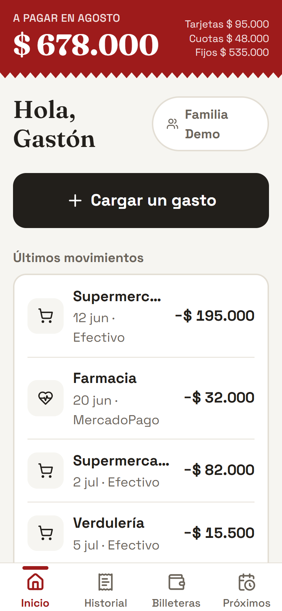
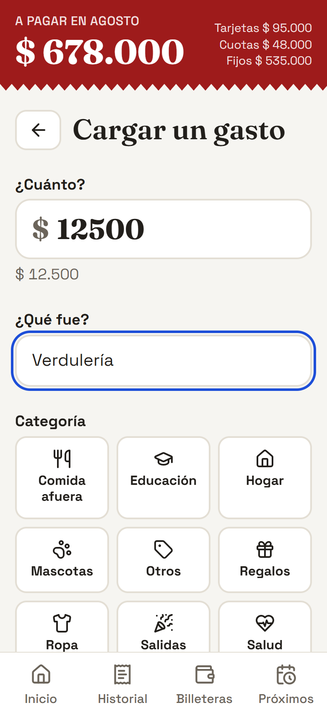
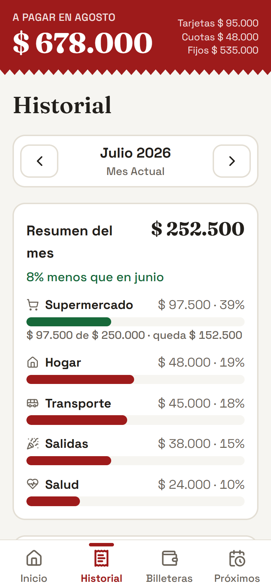
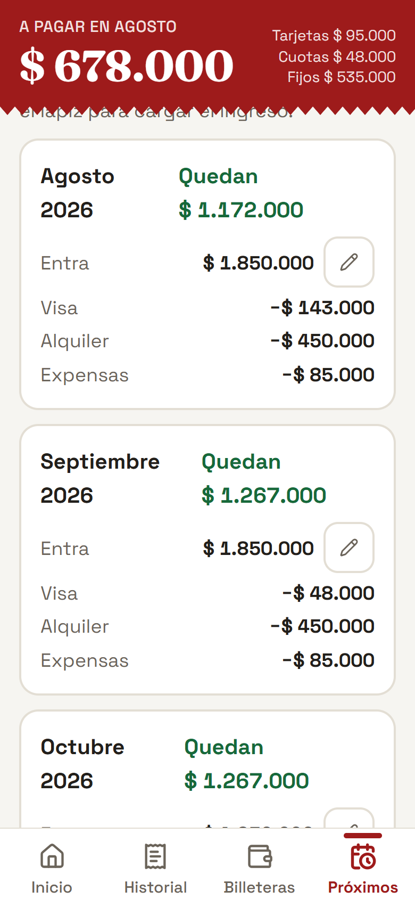
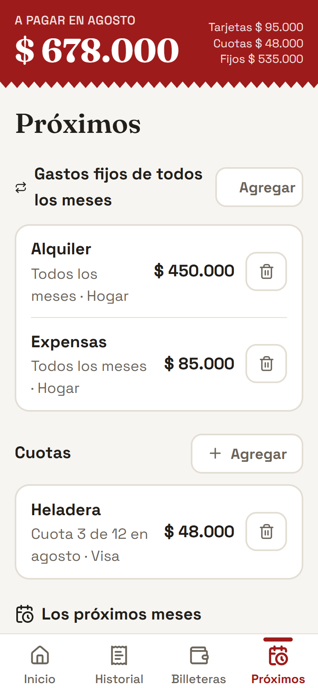
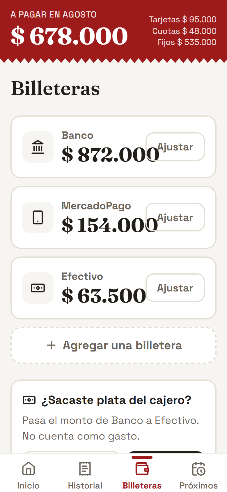

<div align="center">


# Cuentas Claras

**PWA de gastos familiares: carga en 10 segundos, proyección de lo que viene, y toda la familia en la misma cuenta.**

[](https://react.dev)
[](https://vitejs.dev)
[](https://tailwindcss.com)
[](https://supabase.com)
[](https://cuentas-claras-familia.netlify.app)
[](supabase/tests)

**[✨ Probala en vivo → cuentas-claras-familia.netlify.app](https://cuentas-claras-familia.netlify.app)**

Cuenta demo: `demo-portfolio@cuentasclaras.test` · `demo-portfolio-2026`
*(sandbox aislado por Row Level Security — entrá y tocá todo)*

</div>

> **EN** — A family expense tracker PWA built with React + Supabase. Multi-tenant
> (whole family shares one realtime workspace), credit-card purchases roll into
> next month's bill, installment plans and fixed expenses project the months
> ahead, and every business rule lives in Postgres (triggers + RLS), covered by
> a 65-assertion SQL test suite that runs against a disposable Docker Postgres.

---

## Capturas

| El banner rojo, siempre visible | Cargar un gasto | Resumen con topes |
|:---:|:---:|:---:|
|  |  |  |

| Proyección mes a mes | Cuotas y gastos fijos | Billeteras |
|:---:|:---:|:---:|
|  |  |  |

## La idea

La app nació con un requisito no negociable: **tenía que poder usarla una
persona de 85 años**. Eso definió todo — tipografía grande (18px de base),
botones de 48px mínimo, cero jerga financiera, y una sola acción importante
por pantalla.

La segunda idea fuerte es el **banner rojo**: arriba de todo, siempre visible,
está lo que la familia ya se comprometió a pagar el mes que viene (tarjetas +
cuotas + gastos fijos). Es un freno psicológico antes de pasar la tarjeta de
nuevo.

## Qué hace

- 🏠 **Cuenta familiar compartida** — el primer usuario crea la familia y recibe
  un código de invitación; el resto se suma con ese código y ve todo al
  instante (Supabase Realtime en cada tabla).
- ⚡ **Carga en segundos** — monto, categoría en grilla, medio de pago y listo.
  Categorías y medios de pago nuevos se crean inline, sin salir del formulario.
- 💳 **Tarjetas ilimitadas y propias** — "Visa Gastón", "Amex Yami"… Crédito
  imputa al mes siguiente; débito se linkea a una billetera (ej: "BBVA") y
  descuenta al instante.
- 🔢 **Cuotas** — al pagar con crédito elegís en cuántas cuotas; el plan se
  proyecta automáticamente en los meses que vienen. También se cargan planes
  ya empezados ("voy por la 3 de 12").
- 📅 **Gastos fijos** — alquiler, expensas, luz: se cargan una vez y alimentan
  la proyección de todos los meses.
- 📊 **Resumen mensual** — barras por categoría con porcentaje (tocás una y ves
  los movimientos que la suman), presupuestos con semáforo (verde → ámbar →
  rojo), radar de **gastos hormiga** y comparativa contra el mes anterior.
  Exportable a CSV.
- 🚦 **Freno de presupuesto** — al cargar un gasto, si la categoría tiene tope
  te avisa *antes de guardar* cuánto va consumido y si con este gasto te pasás.
- 💵 **Disponible por día** — el Inicio muestra cuánto queda del mes y cuánto
  se puede gastar por día hasta fin de mes.
- 🤝 **Deudas y préstamos** — "me deben / debo" con vencimiento opcional; se
  marcan saldadas con un toque y quedan en el historial.
- ⏰ **Vencimientos con aviso** — fijos con día de vencimiento y deudas con
  fecha aparecen en el Inicio; con "Avisarme", la PWA notifica al abrir la app
  hasta 2 días antes.
- 🔮 **Proyección** — para cada mes futuro: cuánto entra (ingresos con nombre:
  "Sueldo Yami" que se repite todos los meses, "Plata que debía Nico" puntual),
  cuánto sale (por tarjeta y por gasto fijo, ítem por ítem) y cuánto queda.
- 👛 **Billeteras** — saldos de Banco / MercadoPago / Efectivo que se mueven
  solos con cada gasto, ajuste manual, y "¿Sacaste plata del cajero?" que
  transfiere Banco → Efectivo sin contar como gasto.
- 📲 **PWA instalable** — botón "Instalar la app" propio (Android) e
  instrucciones para iPhone; actualización silenciosa al abrir; carga offline
  con cola que sincroniza al volver la señal.

## Stack y arquitectura

**React 18 + Vite 6 · Tailwind CSS v4 · Supabase (Postgres + Auth + Realtime) · vite-plugin-pwa · Netlify**

La decisión central: **la lógica de negocio vive en la base de datos**, no en
el cliente. Cualquier app que inserte una fila obtiene el mismo comportamiento.

- **`billing_month` en cada transacción** — el mes contable al que imputa.
  Un trigger enruta las compras con crédito al mes siguiente; el banner rojo,
  el historial y el cierre mensual son simples agregaciones por esta columna.
- **Saldos por triggers** — insertar/editar/borrar un gasto ajusta la billetera
  correspondiente de forma atómica (editar revierte el efecto viejo y aplica el
  nuevo).
- **Multi-tenant con RLS** — todas las tablas tienen `org_id` y políticas
  `org_id = current_org_id()`. `current_org_id()` es `SECURITY DEFINER` (evita
  recursión de RLS) y las funciones internas están revocadas de la API REST.
- **RPCs atómicas** — `transfer_between_wallets()` (retiro de cajero),
  `settle_card_month()` (cierre de tarjeta, a prueba de doble toque),
  `get_next_month_projection()` (el banner), `check_invite_code()` (validación
  pre-signup).
- **Medios de pago como datos, no como enum** — la tabla `payment_methods`
  (kind `credit`/`debit` + billetera linkeada) reemplazó al enum original sin
  romper datos históricos: los triggers entienden ambos mundos.
- **Realtime por tabla** — cada hook abre su canal con sufijo único
  (`crypto.randomUUID()`): dos componentes pueden montar el mismo hook sin
  colisionar.

```
src/
├── context/    AuthContext (sesión + perfil + org)
├── hooks/      un hook por agregado (wallets, methods, budgets, ledger, ...)
│               → fetch + realtime + mutaciones, la UI no toca supabase-js
│               useSupabaseLive: el patrón carga-inicial + refresco realtime, una sola vez
├── lib/        supabase client, formato AR$, fechas, filtros de pago, cola offline, CSV
├── pages/      Inicio · Cargar · Historial · Billeteras · Próximos · Familia
└── components/ ui/ (piezas de formulario compartidas) · inicio/ · cargar/ ·
                historial/ · proximos/ · ingresos/ · banner, nav, ...

supabase/
├── migrations/ 11 migraciones incrementales (esquema + RLS + triggers + RPCs)
└── tests/      suite SQL: 65 aserciones sobre Postgres 16 en Docker
```

## Tests

Toda regla de negocio del esquema tiene test: enrutamiento de tarjetas,
impacto en billeteras (alta/edición/borrado), aislamiento RLS entre familias,
invitaciones, cierre mensual idempotente, medios de pago custom, gastos fijos
con vigencia y vencimiento, presupuestos, ingresos por ítem (recurrentes y
puntuales) y deudas.

```bash
docker run -d --name cc-test -e POSTGRES_PASSWORD=pw \
  -v "$PWD/supabase:/sql:ro" postgres:16

docker exec cc-test psql -U postgres -v ON_ERROR_STOP=1 \
  -f /sql/tests/00_mock_supabase.sql \
  -f /sql/migrations/00001_init.sql ... -f /sql/migrations/00011_recurring_due_day.sql \
  -f /sql/tests/01_smoke_test.sql ... -f /sql/tests/08_debts_test.sql
# => 65 aserciones verdes
```

El mock (`00_mock_supabase.sql`) simula `auth.users`, `auth.uid()` y los roles
de Supabase, así la suite corre en un Postgres pelado sin depender de nada.

## Correrlo local

```bash
git clone https://github.com/Gaston-Sartini/cuentas-claras.git
cd cuentas-claras
npm install
npm run dev
```

El `.env.production` versionado apunta al proyecto Supabase de producción — la
anon key es pública por diseño (viaja en el bundle del navegador) y la RLS
protege los datos. Para un backend propio: crear un proyecto en Supabase,
correr las migraciones de `supabase/migrations/` en orden desde el SQL Editor,
desactivar *Confirm email* en Auth, y completar `.env` con la URL y anon key
propias.

## Decisiones que me gustan

- **Los retiros de cajero no son gastos.** Mover plata de Banco a Efectivo
  loguea una transacción `kind='transfer'` neutra: no infla el resumen ni la
  proyección.
- **Los gastos fijos son proyección, no transacciones.** Avisan lo que viene;
  cuando llega el mes y pagás las expensas de verdad, cargás el gasto real.
  Nada se cuenta dos veces.
- **El cierre de tarjeta es a prueba de doble toque.** `settle_card_month()`
  calcula el total desde el `UPDATE ... RETURNING`: la segunda llamada devuelve
  0 y no descuenta dos veces.
- **Compatibilidad hacia atrás en serio.** El enum de medios de pago quedó como
  legacy y los triggers entienden ambos formatos: los datos cargados el primer
  día siguen funcionando hoy.

---

<div align="center">
<sub>Hecho por <a href="https://github.com/Gaston-Sartini">Gastón Sartini</a> · React + Supabase · 2026</sub>
</div>
